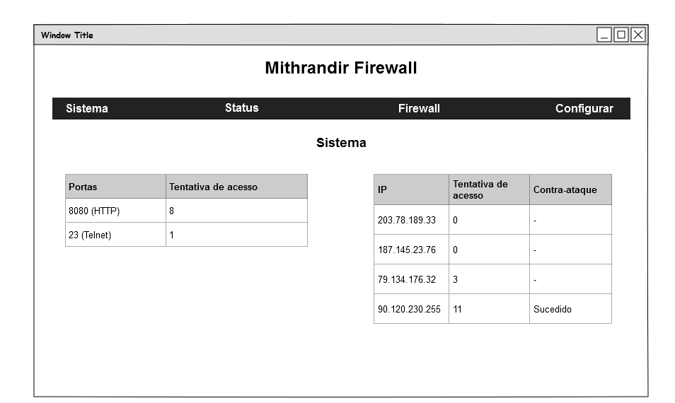
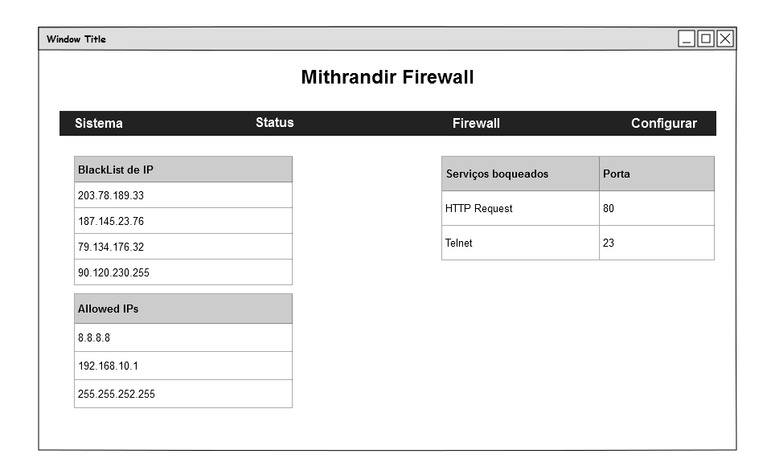
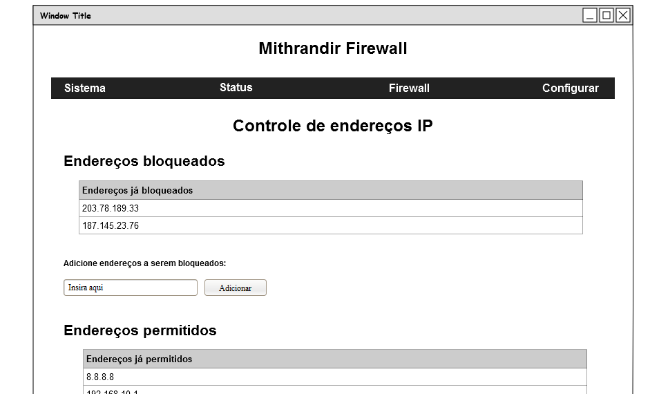
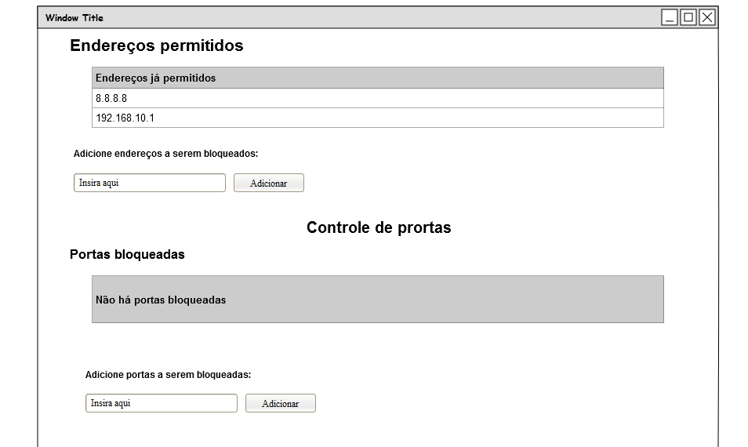

# Mithrandir Firewall


# Objetivo
O firewall é uma parte fundamental de uma rede, sua função é monitorar o tráfego de rede de entrada e saída e decidir permitir ou bloquear esse tráfego de acordo com um conjunto de regras de segurança pré-definidas. Porém, essa função depende de um constante gerenciamento para atualizar ou criar novas regras afim de evitar brechas e falhas de segurança.  Com isso o trabalho proposto visa fornecer uma aplicação web de fácil utilização para otimizar a configuração e gerenciamento de um firewall.

# Ideia principal
A ideia principal é desenvolver uma aplicação web de gerenciamento de um firewall com as seguintes características:
- Controle de endereço IP
- Controle de Portas e Protocolos de comunicação
- Controle de programas
- Definição de regras de acesso
- Contra ataque (Beta)

# Mockups
- Sistema



- Status



- Configurar



# Comandos do Firewall
Alguns comandos que poderão ser usados na configuração do serviço do firewall compreendem principalmente o `iptables`:
``iptables [comandos] [parametros] [extensoes]``

## Alguns [comandos]
* -A: Adiciona uma nova regra
  * INPUT: Sinaliza que é para um pacote que está chegando na máquina;
  * OUTPUT: Sinaliza que é para um pacote que está saindo de máquina;
  * FORWARD: Sinaliza que é um pacote que será redirecionado para outra interface de rede;
  
## Alguns [parametros]
* -p: Protocolos
   * tcp
   * udp
   * icmp
* -s: Source
* -j: O que se deve fazer
   * DROP: Nega o pacote sem enviar flag reset;
   * ACCEPT: Aceita pacote;
   * REJECT: Nega pacote mas envia um flag reset;

## Algumas [extensoes]
* -sport [port:port]: Porta de origem. 
* -dport [port:port]: Porta de destino.
  * Normalmente estas extensões são utilizadas com o comando -m do iptables. Trata-se de um direcionamento de porta(s) origem (-sport) para porta(s) destino(-dport). Pode-se inclusive definir um número padrão de portas para o acesso (port:port). Este comando pode ser utilizado tanto para portas TCP ou UDP.
* -icmp-type: Especifica quais os tipos de pacote icmp podem passar ou não pelo firewall.

### Bloquear IP
Para bloquear um determinado IP que utiliza protocolo TCP, podemos usar:
```
iptables -A INPUT -s 10.0.0.5 -p tcp  -j DROP
```


# Login 
http://giphy.com/gifs/lotr-gandalf-lord-of-the-rings-njYrp176NQsHS
